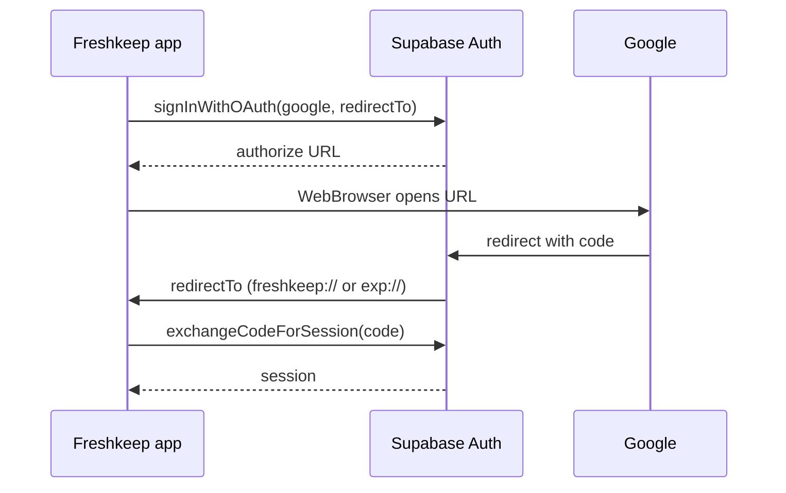

# Google OAuth setup (Supabase + Freshkeep)

Freshkeep uses **Supabase Auth** with **Google** and a **PKCE** flow in the app (`signInWithGoogle` in `context/AuthContext.tsx`). Google Client ID/secret live in the **Supabase dashboard**, not in `.env`.

**Project:** `https://yyesguytzwzvlfmjxjlv.supabase.co`  
**App scheme:** `freshkeep` (see `app.json`)

If Google is not enabled in Supabase, sign-in fails with:

```text
400: Unsupported provider: provider is not enabled
```

---

## Checklist

- [ ] Google Cloud OAuth client created
- [ ] Redirect URI in Google Cloud points at Supabase (`…/auth/v1/callback`)
- [ ] Google provider **enabled** in Supabase with Client ID + secret
- [ ] All app redirect URLs added in Supabase **Redirect URLs**
- [ ] `app/auth/callback.tsx` committed (avoids 404 on deep link)
- [ ] Tested on your target platform (device build, Expo Go, or web)

---

## 1. Google Cloud Console

1. Open [Google Cloud Console](https://console.cloud.google.com/) → select or create a project.
2. **APIs & Services** → **OAuth consent screen**
   - User type: **External** (or Internal for Workspace-only testing)
   - App name, support email, developer contact — fill required fields
   - Scopes: default (`email`, `profile`, `openid`) is enough
   - Add your Google account as a **test user** while the app is in "Testing"
3. **APIs & Services** → **Credentials** → **Create credentials** → **OAuth client ID**
   - Application type: **Web application** (required for Supabase, even for mobile)
   - Name: e.g. `Freshkeep Supabase`
   - **Authorized redirect URIs** — add exactly:

     ```text
     https://yyesguytzwzvlfmjxjlv.supabase.co/auth/v1/callback
     ```

   - Do **not** put `freshkeep://…` here; Google redirects to Supabase first, then Supabase redirects to your app.
4. Copy the **Client ID** and **Client secret**.

---

## 2. Supabase — enable Google

1. [Supabase Dashboard](https://supabase.com/dashboard) → project **yyesguytzwzvlfmjxjlv**
2. **Authentication** → **Providers** → **Google**
3. Turn **Enable Sign in with Google** on
4. Paste **Client ID** and **Client secret** from Google Cloud
5. **Save**

Optional: **Authentication** → **Providers** → Google → note the callback URL shown there; it should match the URI you added in Google Cloud.

---

## 3. Supabase — redirect URLs

**Authentication** → **URL configuration** → **Redirect URLs**

Add every URL your app might use as `redirectTo` (must match **exactly**, including path and port).

### Always add

| Redirect URL | Used when |
|--------------|-----------|
| `https://yyesguytzwzvlfmjxjlv.supabase.co/auth/v1/callback` | Supabase internal OAuth callback |
| `freshkeep://auth/callback` | iOS/Android **development build** or **production** (`scheme` in `app.json`) |

### Expo Go (local dev on device/simulator)

Expo Go uses an `exp://` URL, not `freshkeep://`. The path includes `/--/`.

Add the URL you actually get at runtime (IP/host and port vary):

```text
exp://127.0.0.1:8081/--/auth/callback
exp://localhost:8081/--/auth/callback
```

If you test on a **physical phone**, also add your machine’s LAN URL, for example:

```text
exp://192.168.1.42:8081/--/auth/callback
```

**Tip:** Log the value once in dev. Temporarily add to `signInWithGoogle` in `context/AuthContext.tsx`:

```ts
const redirectTo = Linking.createURL("auth/callback");
if (__DEV__) console.log("[OAuth] redirectTo:", redirectTo);
```

Copy the printed URL into Supabase **Redirect URLs**, then remove the log.

### Web (`npx expo start --web`)

Your logs already used:

```text
http://localhost:8082/auth/callback
```

Add that (and `http://127.0.0.1:8082/auth/callback` if you use it). Web Google sign-in may need extra work beyond the mobile `WebBrowser` flow; mobile is the primary path today.

### Site URL (same page)

Set **Site URL** to your main app entry, e.g.:

- Local web: `http://localhost:8082`
- Production (later): `https://your-domain.com`

---

## 4. App repo

Ensure the callback route exists (handles deep link landing; session exchange runs in `AuthContext`):

- `app/auth/callback.tsx` → route `/auth/callback`

Commit it if it is still untracked:

```bash
git add app/auth/callback.tsx
```

No Google secrets belong in `.env` — only:

```env
EXPO_PUBLIC_SUPABASE_URL=https://yyesguytzwzvlfmjxjlv.supabase.co
EXPO_PUBLIC_SUPABASE_ANON_KEY=your_anon_key
```

Restart Metro after env changes: `npx expo start -c`

---

## 5. Test sign-in

1. Start the app: `npx expo start -c`
2. Open the **start** screen → **Continue with Google**
3. Complete Google login in the browser sheet
4. You should return to the app and land on **tabs** (profile loaded)

### If it fails

| Symptom | Likely fix |
|---------|------------|
| `provider is not enabled` | Enable Google under Supabase **Providers** |
| `redirect_uri_mismatch` (Google) | Google Cloud redirect URI must be `https://yyesguytzwzvlfmjxjlv.supabase.co/auth/v1/callback` only |
| Redirect / callback error (Supabase) | Add the exact `redirectTo` URL to Supabase **Redirect URLs** |
| Browser closes, no session | Wrong `exp://` URL for Expo Go — log `redirectTo` and add that URL |
| 404 after redirect | Add/commit `app/auth/callback.tsx` |
| `Google sign-in did not return an authorization code` | Callback URL mismatch or user cancelled |

**Supabase:** **Authentication** → **Logs** — filter for `/authorize` and failed events.

---

## Flow (reference)



---

## Related code

- `context/AuthContext.tsx` — `signInWithGoogle`
- `app/(auth)/start.tsx` — Google button
- `app/auth/callback.tsx` — deep link landing
- `lib/supabase.ts` — `flowType: "pkce"`
